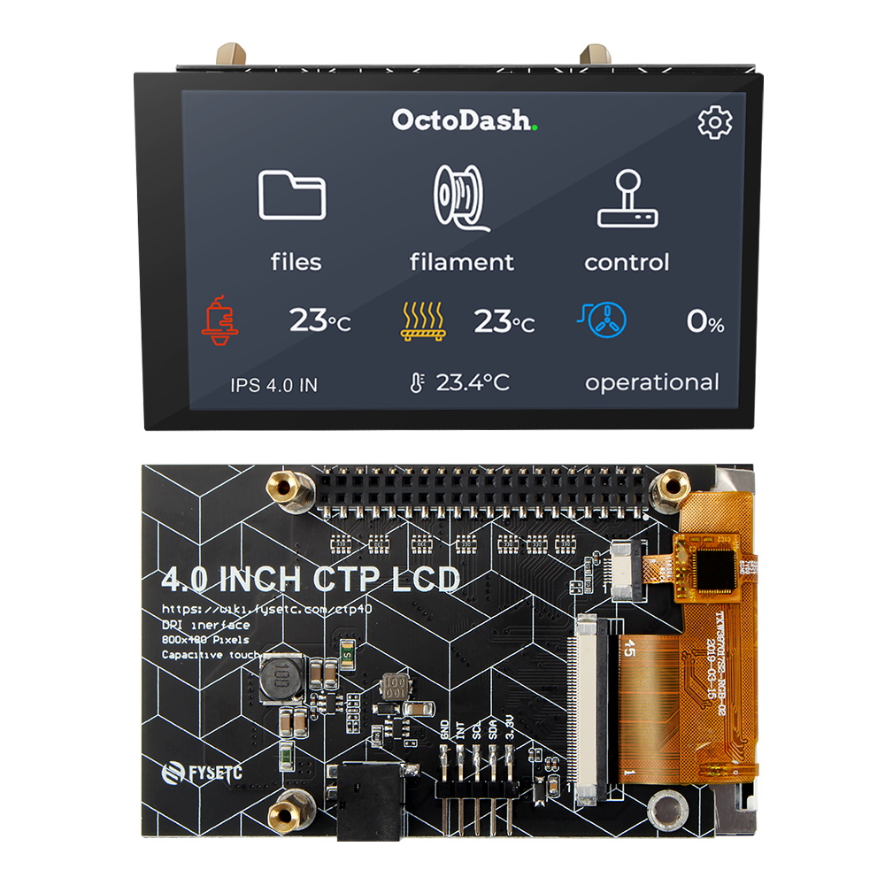
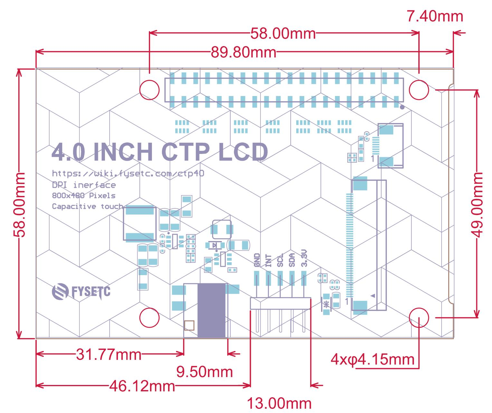
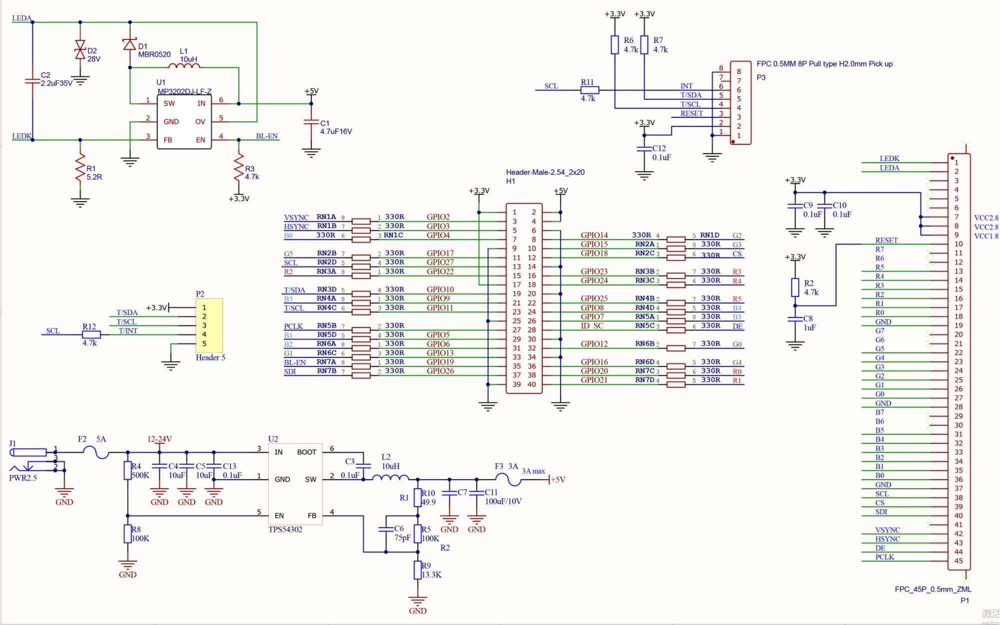
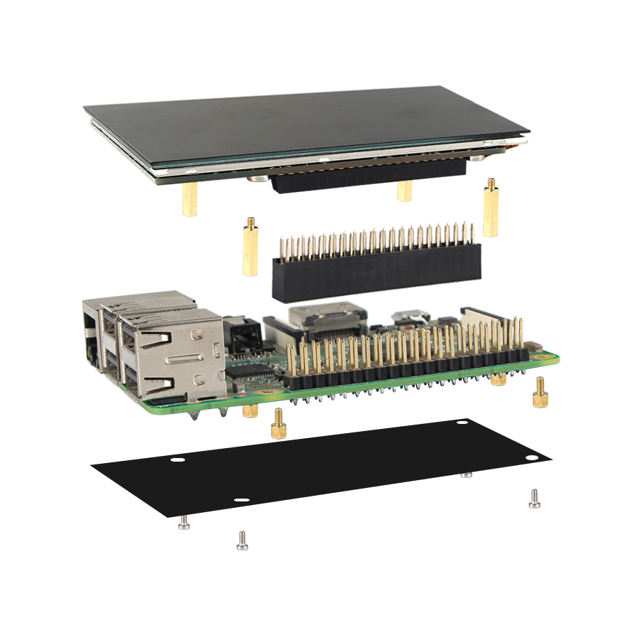
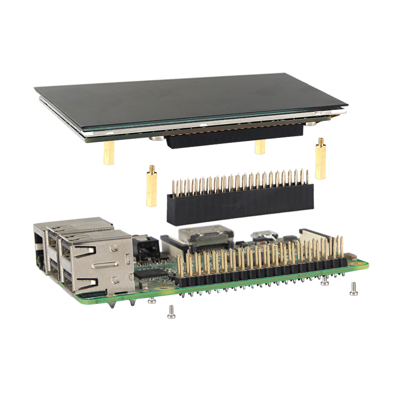

# 4 INCH CTP LCD Drivers

------



4 INCH CTP LCD(CTP40) is an 800x480 pixel display for the Raspberry Pi, with optional capacitive touchscreen.

## 1. Features

- Size: 89.8mm x 58mm, the holes are fully compatible with Raspberry Pi .
- High-speed DPI interface
- 5V@3A DC-DC onboard(9-28V input)
- 4.0“ IPS (wide viewing angle, 160°) display (86.4x51.8mm)
- 800x480 pixels (~235 PPI)
- 18-bit colour (262,144 colours)
- 60 FPS frame rate
- Contrast ratio: 500:1
- Capacitive touch
- 40-pin female header included
- Standoffs included
- Compatible with all 40-pin header Raspberry Pi models
- Easy to install

## 2. Dimensions



## 3. Schematic diagram




You can download it on our [Github](https://www.aliexpress.com/item/1005001704413148.html)

## 4. Install

### 4.1 Pi install

If your Raspberry Pi needs to be fixed on the panel:

If your Raspberry Pi is not fixed:


### 4.2 Driver install

Clone this repo first, run 

```
git clone https://github.com/FYSETC/FYSETC-CTP40
```

There are three folder name `Pi3` and `Pi4` and `Pi4-64-beta`, If you are using  Raspberry Pi3 and older device, please follow the README file in `Pi3` folder. And if you are using Raspberry Pi4 32bit OS, then follow the README file in `Pi4` folder. And if you are using Raspberry Pi4 64bit OS, then follow the `README` file in `Pi4-64-beta` folder.

if you run bullseye system and you get blank screen, better to comment out below in `/boot/config.txt` file. Don't have a better solution now, i will keep looking into it.

```
#dtoverlay=vc4-kms-v3d
```

## 5. How to change backlight

### Step 1. Install pigpio

First we need to install pigpio library, you can follow the instruction [here](http://abyz.me.uk/rpi/pigpio/download.html).

```
wget https://github.com/joan2937/pigpio/archive/master.zip
unzip master.zip
cd pigpio-master
make
sudo make install
```

If the Python part of the install fails it may be because you need the setup tools.

```
sudo apt install python-setuptools python3-setuptools
```

### Step 2. Copy `backlight.py` to your pi

There is `backlight.py` file in the repo, copy it to`/home/pi` path

### Step 3. Enable `backlight.service`

Copy the `backlight.service` file in this repo to `/etc/systemd/system`

```pigpiod
sudo cp backlight.service /etc/sysetmd/system/backlight.service
```

inform `systemd` that a new service has been added. This is done with the following command:

```
sudo systemctl daemon-reload
```

Now you can attempt to start the service using the following command:

```
sudo systemctl start backlight.service
```

Enable it to run at boot

```
sudo systemctl enable backlight.service
```

### Step 4. Change backlight value

```
nano /pi/home/backlight.py
```

change `128` to the value you want.

### Step 5. Reboot

```
sudo reboot
```

## 6. OS image

We provide you and example OS image here([dropbox](https://www.dropbox.com/s/4nabe5on0xgnlrw/CTP40-pi4-octopi0.18-octoprint-octoscreen-octolapse-polarcloud-octopod-fysetc-splashscreen.img?dl=0)) for you. It is base on `Octopi0.18`. 

### 6.1 how to flash

Before flash, you need an SD card , minimum requirement of SD card capacity is 8G. Please prepare that first. And then you can use this software [here](https://www.balena.io/etcher/) to install. Well that are so many OS flash tool that you can use. And there are a lot of tutorial if you google `how to flash os image`.

## 7. Shop

[FYSETC-4INCH CTP LCD](https://www.aliexpress.com/item/1005002011585873.html?spm)

## 8. Tech Support

Please submit any technical issue into our [github](https://github.com/FYSETC/FYSETC-CTP40) or [forum](http://forum.fysetc.com/) 